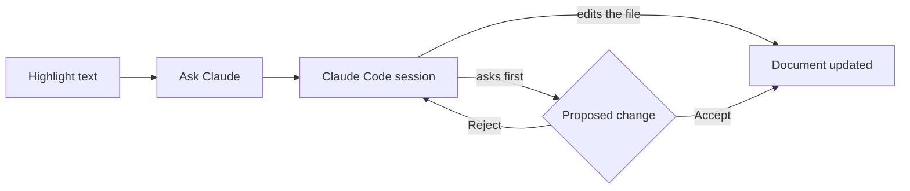

# Welcome

This editor renders markdown the way GitHub does, and it has Claude Code built in, in the panel on the right. Highlight any passage, in the source or in the preview, and ask Claude to rewrite it, tighten it, change its style or just comment on it. The question goes to that Claude Code session with your selection, as in VS Code, and Claude edits the file itself: you see each change as it lands, or, if Claude asks before editing, as a diff to **accept** or **reject**.

## Things to try

- [x] Open this file
- [ ] Highlight the paragraph above in the preview and choose *Tighten*
- [ ] Select some text and press <kbd>Ctrl</kbd>+<kbd>J</kbd> to type your own instruction
- [ ] Select some lines and press <kbd>Ctrl</kbd>+<kbd>Alt</kbd>+<kbd>L</kbd> to put a reference to them in Claude's prompt
- [ ] Edit this file from a terminal and watch the change appear here

> [!NOTE]
> Files live on disk, so Claude Code in a terminal can edit them too. The editor picks up changes within a second.

> [!WARNING]
> If both of you edit at once, the editor asks which version to keep.

## Formatting

| Feature | Syntax | Shown as |
| --- | --- | --- |
| Emphasis | `**bold**`, `_italic_`, `~~strike~~` | **bold**, _italic_, ~~strike~~ |
| Inline maths | `$E = mc^2$` | $E = mc^2$ |
| Link | `[GitHub](https://github.com)` | [GitHub](https://github.com) |

Display maths:

$$
\mathbf{Q} = \mathbf{k}_f - \mathbf{k}_i, \qquad |\mathbf{Q}| = \frac{4\pi}{\lambda}\sin\theta
$$

```python
def bragg(d, wavelength):
    """Return the Bragg angle in degrees."""
    return math.degrees(math.asin(wavelength / (2 * d)))
```



Footnote-style asides and HTML such as <sup>superscript</sup> also work.
